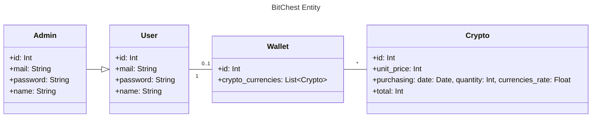
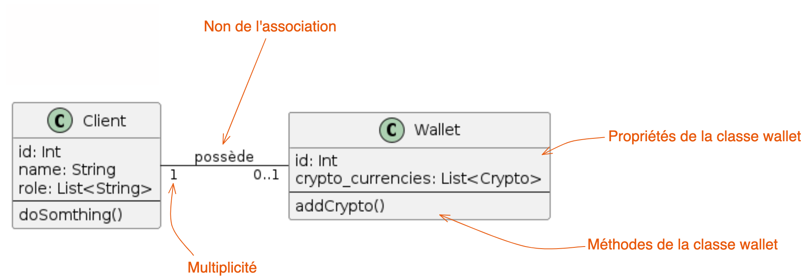
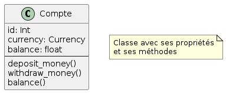
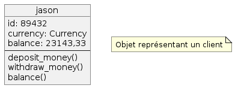
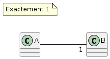
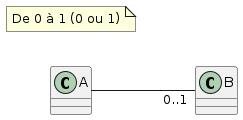
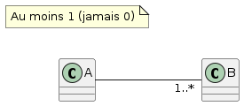
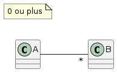

# Diagramme de class



# Example d'un simple diagramme de classe



# Représentation d'une classe



# Représentation d'un objet



# Multiplicité en pratique

Nombre d'objets de la classe B associés à un objet de la classe A.









# Example d'utilisation de plantUML

[PlantUML](https://plantuml.com/fr/) est un outil open-source permettant de créer des diagrammes à partir d'un langage de texte brut.

Vous avez d'autres outils open-source pour la création de diagramme comme :
- [JetUML](https://www.jetuml.org/).
- [app.diagrams.net](https://app.diagrams.net/)
- et bien d'autre...

Voici un dernier outils, si vous préférer le drag-and-drop pour faire vos diragram : [moqups](https://moqups.com/).

## Example d'un script pour faire un diagramme de classe avec plantUML

```txt
@startuml
left to right direction

Client "1" -- "0..1" Wallet : possède

class Client {
  id: Int
  name: String
  role: List<String>
  ---
  doSomthing()
}

class Wallet {
  id: Int
  crypto_currencies: List<Crypto>
  ---
  addCrypto()
}

note as N1
  0 ou plus
end note
@enduml
```